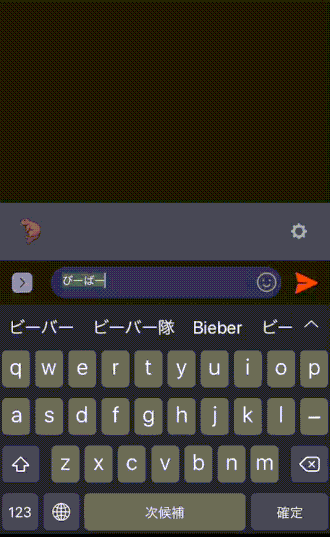

Line BOT Itaraction of Expect Japanes Fes's Setlist
====

## Description

アーティストごとにフェスのセトリを予想する LINE BOT

## Requirement

- https://github.com/line/line-bot-sdk-python
- https://github.com/wention/BeautifulSoup4

## Usage

- LINE BOTを登録してアーティスト名をメッセージで送信  

## Install

1. AWSにて、severless deploy用のIAMを作成し、keyとaccess tokenを取得
2. [LINE developers](https://developers.line.biz/ja/)でチャンネルの登録を行い、Channel SecretとChannel Access Token(アクセストークン ロングターム)を取得
    - この辺を参考に https://qiita.com/fkooo/items/d07a7b717e120e661093
3. `cp ./.env.local ./.env`
4. `.env`に上記の各種key,tokenを記載
5. `docker-compose build`
6. `docker-compose run --rm serverless deploy -v`
7. CI上に表示されるエンドポイントURLを、先程LINE developersで作成したチャンネルのWebhook URLに登録
8. インストール完了

## Licence

[MIT](https://github.com/aiji42/serverless-expect-fes-setlist-line-itaraction/blob/master/LICENSE)

## Author

[AijiUejima](https://github.com/aiji42)
